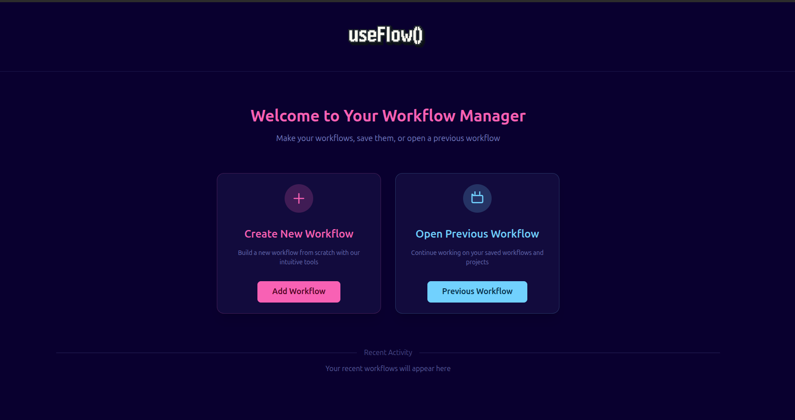
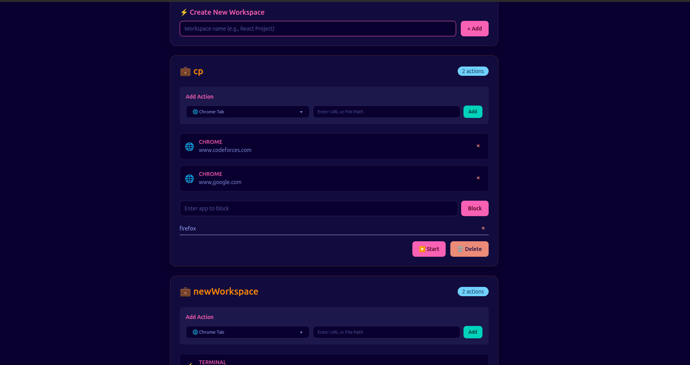

# 🚀 useFlow

A desktop productivity app built with **Electron.js** that helps you manage workspaces, launch tools efficiently, and stay focused by blocking distracting applications.

---

## ✨ Features

- **Workspace Manager** – Create and switch between different workspaces, each with its own set of apps, scripts, and workflows.
- **App Launcher** – Automatically launch applications, open files, or run commands when starting a workspace.
- **App Blocker** – Temporarily block distracting apps (e.g., browsers, games, social media apps) while you work. (Linux only)
- **Persistent Storage** – User data (workspaces, blocked apps) is saved locally in JSON for easy persistence.

---

## 🛠️ Tech Stack

- [Electron.js](https://www.electronjs.org/) – Desktop app framework
- [React](https://react.dev/) – UI rendering
- [Vite](https://vitejs.dev/) – Build tool and dev server
- [TailwindCSS](https://tailwindcss.com/) – Styling
- [DaisyUI](https://daisyui.com/) – UI components
- [Node.js](https://nodejs.org/) – Backend logic & APIs

---

## 📸 Screenshots

### Home Screen


### Add Workspace Screen


---


## 🚀 Getting Started

### Prerequisites

- [Node.js](https://nodejs.org/) (v16 or higher)
- [npm](https://www.npmjs.com/)

### Installation

1. Clone the repository:

```bash
git clone https://github.com/your-username/useflow.git
cd useflow
```

2. Install dependencies:

```bash
npm install
```

3. (Optional) Set up App Blocker (Linux only):

```bash
cd blocker_setup
sudo ./install.sh
sudo systemctl start app-blocker.service
```

### Usage

- **Development mode:**

```bash
npm run dev
```

- **Build the app:**

```bash
npm run build
```

- **Preview the built app:**

```bash
npm start
```

- **Build for specific platforms:**

```bash
# Windows
npm run build:win

# macOS
npm run build:mac

# Linux
npm run build:linux
```

### How to Use

1. Launch the app using `npm run dev`.
2. On the Home screen, view your existing workspaces.
3. Click "Add Workspace" to create a new workspace.
4. Configure your workspace with apps to launch, files to open, or commands to run.
5. (Linux only) Add apps to block while working on this workspace.
6. Start the workspace to launch all configured items and block distracting apps.

---

## 📁 Project Structure

```
useflow/
├── src/
│   ├── main/          # Electron main process
│   ├── preload/       # Preload scripts
│   └── renderer/      # React frontend
├── blocker_setup/     # App blocker installation scripts (Linux)
├── assets/            # Screenshots and icons
├── build/             # Build configurations
└── package.json       # Project dependencies and scripts
```

---

## 🤝 Contributing

Contributions are welcome! Please feel free to submit a Pull Request.

1. Fork the project
2. Create your feature branch (`git checkout -b feature/AmazingFeature`)
3. Commit your changes (`git commit -m 'Add some AmazingFeature'`)
4. Push to the branch (`git push origin feature/AmazingFeature`)
5. Open a Pull Request

---


## 🙏 Acknowledgments

- [Electron](https://www.electronjs.org/) for the desktop app framework
- [React](https://react.dev/) for the UI library
- [TailwindCSS](https://tailwindcss.com/) and [DaisyUI](https://daisyui.com/) for styling
